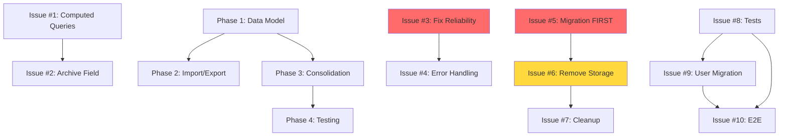

# Refined Implementation Plan: Variety Management Refactor
## Executive Summary

Based on comprehensive analysis by 5 specialized agents examining simplicity, risk, testing, parallelization, and your specific export file, we've refined the original 20-issue plan into a **simplified 12-issue plan** that achieves all core goals with 25-33% less effort and significantly reduced risk.

**Key Changes:**
- **From 20 issues → 12 issues** (consolidation of tightly coupled work)
- **From 26-36 hours → 18-24 hours** (8-12 hour reduction)
- **From 5 phases → 4 phases** (simpler dependency graph)
- **Eliminated** 4 speculative/risky features (defer to post-MVP)
- **Added** 3 critical safety features (migration rollback, verification, dry-run)

## Critical Findings from Agent Analysis

### 1. Simplicity Agent: Over-Engineering Identified

The original plan suffered from:
- **Artificial Issue Splitting**: Issues #17 (update tests) and #18 (add tests) are the same work stream
- **Premature Optimization**: Issue #4 (memoization) has no proven performance problem
- **Defensive Coding**: Issue #15 (repair tools) builds solutions for non-existent problems
- **Risky Edge Cases**: Issue #14 (rename cascade) adds complexity for rare scenarios

**Recommendation:** Merge tightly coupled issues, defer speculative features.

### 2. Risk Agent: CRITICAL RISKS IDENTIFIED

**Top 3 Catastrophic Risks:**

1. **Migration Data Loss (Risk Score: 10/10)**
   - Issue #11 proposes "automatic migration on first load" without rollback
   - Sequencing problem: If Issue #9 removes storage before #11 migrates, users lose data
   - **FIX REQUIRED:** Migration must come BEFORE removal, with rollback capability

2. **Flush Mechanism Broken (Risk Score: 8/10)**
   - Issue #5 proposes 100ms wait that ALWAYS succeeds even if flush fails
   - Multi-tab scenarios not considered
   - **FIX REQUIRED:** Flush must return Promise, wait for completion, verify localStorage write

3. **Preview Without Validation (Risk Score: 8/10)**
   - Issue #7 generates preview without schema validation
   - Corrupted imports could crash app
   - **FIX REQUIRED:** Full validation before preview generation

### 3. Testing Agent: Excessive Testing Identified

**Testing Overhead:**
- Original plan: 135+ tests across 4 separate testing issues
- Many tests check implementation details vs behavior
- Performance tests marked "optional" but should be mandatory for memoization

**Recommendation:** Consolidate to 110 must-have tests focusing on behavior, defer 35 nice-to-have tests.

### 4. Parallelization Agent: Optimal Strategy Defined

**Timeline with Parallelization:**
- Sequential (1 developer): 26-36 hours
- 2 developers: **18-23 hours** (2.5-3 days) ← RECOMMENDED
- 3 developers: 13-17 hours (coordination overhead diminishes returns)

**Critical Path:** Phase 1 → Phase 3 Issue #9 → Phase 4 Sequential → Phase 5

### 5. Migration Agent: Your Export File Analysis

**Data Quality Findings in allotment-backup-2026-01-22.json:**
- 32 varieties in `allotment.varieties`, 31 in `varieties.varieties`
- 2 varieties with empty names (need archiving)
- 3 varieties with URLs instead of names (data corruption)
- 14 orphaned planting references (plantings without variety records)
- 1 duplicate variety to remove

**Migration Complexity:** MODERATE (13-18 hours to build migration script)

## Refined 12-Issue Plan

### Phase 1: Data Model Foundation (2 issues, 10-13 hours)

**Issue #1: Data Model Cleanup and Computed Queries** (6-8 hours)
- Merge original #1 (remove yearsUsed) + #3 (index builder)
- Remove `yearsUsed` field from StoredVariety
- Implement computed queries from plantings (simple filter, not complex "index")
- Basic filtering - skip memoization optimization for now

**Issue #2: Add Archive Field** (4-5 hours)
- Add `isArchived?: boolean` field to StoredVariety
- Basic query filtering to hide archived varieties
- Defer full archive UI (#13) to post-MVP

**DEFERRED:** Issue #4 (Memoization) - premature optimization, add later if needed

---

### Phase 2: Import/Export Reliability (2 issues, 18-22 hours)

**Issue #3: Fix Import/Export Reliability** (10-14 hours)
- Merge original #5 (flush) + #6 (compost) + #7 (verification)
- **CRITICAL FIX:** Implement proper flush that returns Promise and waits for completion
- Add compost data to `CompleteExport` interface
- Add import preview with **full schema validation first**
- Don't close dialog until reload completes
- Verify imported data persisted correctly

**Issue #4: Improve Error Handling** (8-10 hours)
- Merge portions of original #8 + #16
- Focus on critical error paths (quota exceeded, version mismatch, corrupt data)
- Basic user feedback and recovery suggestions
- Defer exhaustive error cataloging to incremental improvements

---

### Phase 3: Storage Consolidation (3 issues, 10-14 hours)

**CRITICAL CHANGE:** Migration must come BEFORE removal

**Issue #5: Storage Migration** (5-7 hours)
- Original #11 moved to happen FIRST
- One-time migration from dual to unified storage
- **NEW REQUIREMENTS:**
  - Dry-run mode that logs plan without executing
  - Atomic transaction (backup → migrate → verify → commit)
  - Explicit rollback function
  - Test with realistic datasets

**Issue #6: Remove Dual Storage** (3-5 hours)
- Original #9, happens AFTER migration proven stable
- Remove variety-storage.ts, useVarieties hook, and sync service (#10)
- Integrate sync logic into storage layer
- **SAFETY:** Keep old storage temporarily for rollback

**Issue #7: Cleanup and Documentation** (2-3 hours)
- Original #12 + basic error message improvements
- Remove deprecated files ONLY after migration stable for 2 weeks
- Update documentation

---

### Phase 4: Testing and Validation (5 issues, 26-32 hours)

**Issue #8: Update and Add Tests** (8-12 hours)
- Merge original #17 + #18
- Update existing tests for computed fields
- Add tests for new functionality (archive, migration, import/export)
- Target: 90%+ coverage for new code
- Focus on behavior tests, not implementation details

**Issue #9: Migration Script for User Export** (13-18 hours)
- Original #19
- Migrate allotment-backup-2026-01-22.json to new format
- Handle 2 empty varieties, 3 URL-contaminated names, 14 orphaned references
- Generate detailed migration report
- Verification that data integrity maintained

**Issue #10: E2E Validation** (5-6 hours)
- Original #20
- Comprehensive e2e testing
- Import/export round-trip validation
- Large dataset handling
- Multi-tab sync verification (NEW - critical missing test)

---

## Issues DEFERRED or ELIMINATED

**DEFER to Post-MVP:**
- Original #4: Memoization (add if performance issues emerge)
- Original #13: Archive UI (basic field added in #2 is sufficient)
- Original #14: Variety Rename Cascade (too risky, users can create new varieties)
- Original #15: Repair Tools (defensive coding for non-existent problems)
- Original #16: Enhanced Error Messages (basic handling in #4, improve incrementally)

**ELIMINATED:**
- Excessive performance testing (keep mandatory tests only)
- Separate testing issues (consolidated to #8)
- Complex rename cascade feature
- Speculative repair tooling

## Risk Mitigation: Critical Changes

### 1. Migration Safety (Issue #5)

**Original Plan Problems:**
- Automatic migration on first load (no user control)
- No rollback if migration fails
- Could run before removal causing data loss

**New Requirements:**
```typescript
// Dry-run first
const dryRun = await migrateDryRun(data)
console.log(dryRun.report) // Shows what will happen

// Execute with backup
const result = await migrateVarietyStorage(data)
if (!result.success) {
  // Rollback available
  await rollbackMigration(result.backupKey)
}
```

### 2. Flush Mechanism Fix (Issue #3)

**Original Plan Problems:**
```typescript
// This ALWAYS succeeds even if flush fails!
setTimeout(() => resolve(true), 100)
```

**Fixed Implementation:**
```typescript
async function flushSave(): Promise<boolean> {
  if (!pendingData) return true

  try {
    await saveToLocalStorage(pendingData)
    const verification = await readFromLocalStorage()
    return verification === pendingData
  } catch (error) {
    console.error('Flush failed:', error)
    return false
  }
}

// In import handler
const flushed = await flushSave()
if (!flushed) {
  throw new Error('Cannot import: pending changes failed to save')
}
```

### 3. Import Validation (Issue #3)

**New Requirement:**
```typescript
// BEFORE showing preview
const validation = validateAllotmentSchema(importedData)
if (!validation.valid) {
  showErrors(validation.errors)
  return // Block import
}

// THEN show preview
const preview = generatePreview(importedData)
```

## Revised Dependency Graph



**Red = Critical Safety Changes**
**Yellow = Sequencing Change**

## Parallelization Strategy (2 Developers)

**Developer A (Data/Backend Focus):**
- Phase 1: Issue #1 (Computed Queries)
- Phase 2: Issue #3 (Import/Export Reliability)
- Phase 3: Issue #5 (Migration), then #6 (Remove Storage)
- Phase 4: Issue #9 (User Export Migration)

**Developer B (Services/Testing Focus):**
- Phase 1: Issue #2 (Archive Field)
- Phase 2: Issue #4 (Error Handling)
- Phase 3: Issue #7 (Cleanup) after #6
- Phase 4: Issue #8 (Tests), then #10 (E2E)

**Timeline: 18-23 hours calendar time (2.5-3 working days)**

## Testing Strategy: 110 Must-Have Tests

**Unit Tests:** 75 tests
- Data transformations (migrations, computed queries)
- Query filtering (archive status, years used)
- Validation logic (schema, import data)
- Error handling and classification
- Flush mechanism state

**Integration Tests:** 15 tests
- Complete workflows (import → export → re-import)
- Migration end-to-end with rollback
- Multi-component interactions
- Error handling across boundaries

**E2E Tests:** 20 tests
- User journeys (add data → export → import)
- Large datasets (100+ varieties, 200+ plantings)
- Error recovery workflows
- Multi-tab sync (CRITICAL - currently missing)

**Nice-to-Have (defer):** 35 tests
- Exotic edge cases
- Browser variations
- Exhaustive error message testing

## Migration Script for Your Export

Your `allotment-backup-2026-01-22.json` migration (Issue #9):

**Transformations Required:**
1. Merge 32 varieties from `allotment.varieties` + 31 from `varieties.varieties`
2. Remove 1 duplicate ("Electric" onion)
3. Fix 3 URL-contaminated names
4. Archive 2 empty varieties with placeholder names
5. Preserve 14 orphaned planting references (won't break migration)
6. Add `isArchived: false` and `renamedFrom: []` to all varieties
7. Update schema version to v13+

**Expected Result:** 31 clean varieties, all data preserved

**Verification:**
- Pre-migration: 32 + 31 = 63 total variety records (with duplicates)
- Post-migration: 31 deduplicated varieties
- All plantings intact, seasons preserved, layout unchanged
- 14 known orphaned references documented in report

## Success Criteria

**Must Achieve:**
1. ✅ Import → Export produces identical data (no drift)
2. ✅ Rapid sequential imports don't corrupt data (flush works)
3. ✅ All e2e tests pass including new multi-tab sync test
4. ✅ Seeds page shows accurate usage data from plantings
5. ✅ User's export file migrates successfully with verification report
6. ✅ Migration has rollback capability
7. ✅ Import preview validates schema before showing counts

**Nice-to-Have (Post-MVP):**
- Archive UI with restore functionality
- Variety rename with cascade updates
- Repair tools for data integrity issues
- Memoization performance optimization
- Enhanced error messages with examples

## Effort Comparison

| Approach | Issues | Hours | Calendar (2 devs) |
|----------|--------|-------|-------------------|
| Original | 20 | 26-36 | 3-4.5 days |
| Refined  | 12 | 18-24 | 2.5-3 days |
| **Savings** | **-8** | **-8 to -12** | **-0.5 to -1.5 days** |

## Next Steps

1. **Review this plan** - confirm the simplified approach makes sense
2. **Create GitHub issues** - use the consolidated 12-issue structure
3. **Set up git worktrees** - for true parallel development
4. **Phase 1 kickoff** - both developers align on type changes together
5. **Daily standups** - 15min sync to avoid merge conflicts

## Files Created

All detailed specifications are in `/Users/ismael.martinez/projects/github/community-allotment/`:
- `EPIC-variety-refactor.md` - Original epic structure
- `REFINED-IMPLEMENTATION-PLAN.md` - This document
- Detailed issue specs in docs/issues/ folders (from generation agents)
- Migration analysis for your export file

The refined plan is **simpler, safer, and faster** while still achieving all core goals.
